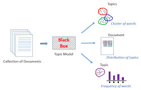

# An NLP Approach to Mining YDC Reviews using Topic Modeling

## Background

Amazon solicits reviews from general users for it's merchants. A user is also required to rate a business on a scale of 1-5 star ratings. While a rating is valuable and concise enough to help a user make assertions around what to expect from the business, ratings alone do not give a complete picture of the products or service we wish to purchase.

Typically, to overcome this a user is advised to read product reviews before deciding whether to buy it or not. However,if the business has hundreds or thousands of reviews, this becomes unfeasible. 

This is where natural language processing comes up trumps.

## Problem statement

As mentioned above, online reviews are great but if they are in large volumes then they can be overwhelming. 

Therefore, an intelligent system, capable of finding key insights (topics) from these reviews, will be of great help for both the consumers and the merchants. 

This system should serve two purposes:

 - Enable consumers to quickly extract the key topics covered by the reviews without having to go through all of them
 - Help the merchants get consumer feedback in the form of topics (extracted from the consumer reviews)

## Strategy

To solve the above problem, we will use the concept of Topic Modeling (LDA) on Amazon review data.

### Topic modelling

As the name suggests, Topic Modeling is a process to automatically identify topics present in a text object and to derive hidden patterns exhibited by a text corpus. 

Topic Models are very useful for multiple purposes, including:

- Document clustering
- Organizing large blocks of textual data
- Information retrieval from unstructured text
- Feature selection

A good topic model, when trained on some text about the plumbing, should result in topics like “car”, “quality”, “durability”. The below image illustrates how a typical topic model works:

 

### Model: Latent Dirichlet Allocation (LDA)

[Latent Dirichlet Allocation (LDA)](http://blog.echen.me/2011/08/22/introduction-to-latent-dirichlet-allocation/) is an example of topic model and is used to classify text in a document to a particular topic. It builds a topic per document model and words per topic model, modeled as Dirichlet distributions.

For more details watch this video [LDA topic models](https://www.youtube.com/watch?v=3mHy4OSyRf0)

## Python Implementation

As with any Machine Learning problem, the code covers the following key stages -

 * Data retrieving 
 
 To access the data you need to query the table "datahub.review_t"
 
 * Data pre-processing
 Here the goal will be to -
   - Remove stop words
   - Lemmatisation
 
 * Building the model
 * Visualise the results

## Results

## Other methods 

